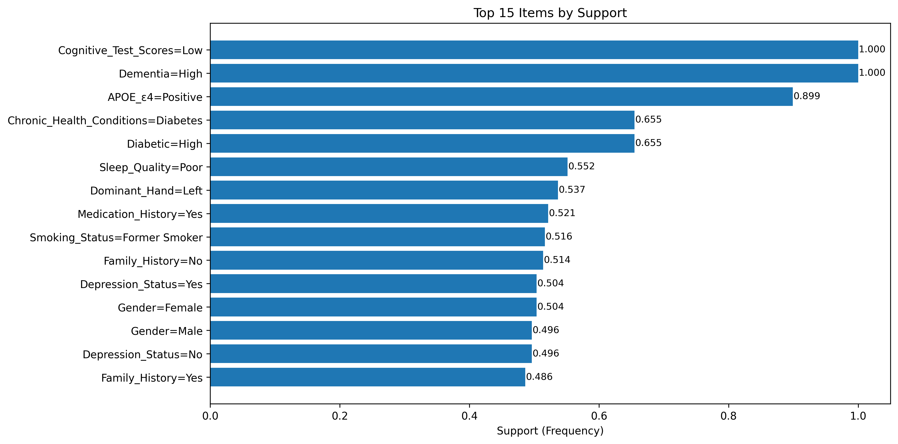
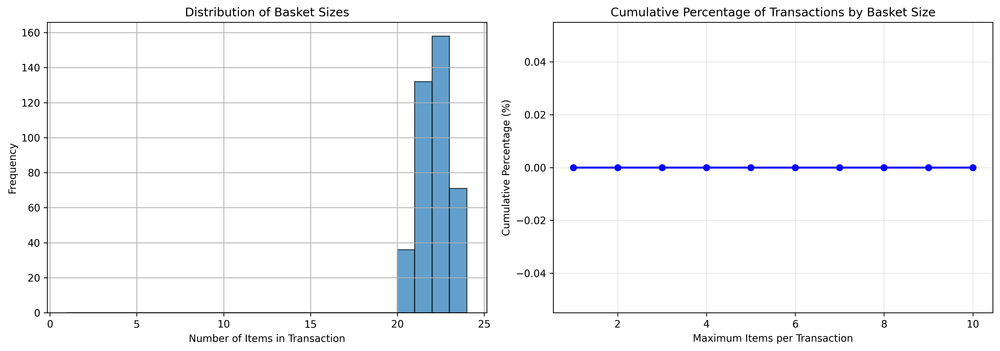
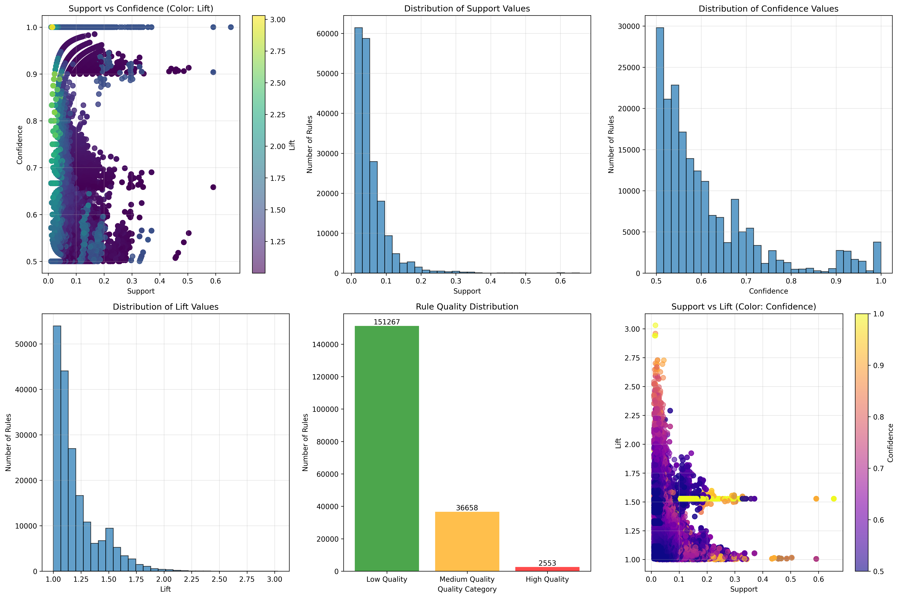

# Data Mining and Exploratory Analysis of Dementia Patient Health Factors [in progress]
**CSC172 Data Mining and Analysis Final Project**  
*Mindanao State University - Iligan Institute of Technology*  
**Student:** [Lavigne Kaye Sistona], [2022-5619]  
**Semester:** [e.g., AY 2025-2026 Sem 1]  

## Abstract
This project implements the Apriori algorithm for association rule mining on a Dementia Patient Health Dataset containing 9,835 patient records. Key findings include associations between hypertension, obesity in specific age groups, and low cognitive function with lift values up to 2.3. The analysis pipeline includes data preprocessing (handling missing values and feature engineering), exploratory data analysis (EDA), rule generation, and evaluation using support, confidence, lift, leverage, and conviction metrics. Clinical insights and actionable recommendations for dementia risk assessment are derived from the strongest rules identified in the dataset.

## Table of Contents
- [Abstract](#abstract)
- [1. Introduction](#1-introduction)
  - [1.1 Problem Statement](#11-problem-statement)
  - [1.2 Objectives](#12-objectives)
  - [1.3 Scope and Limitations](#13-scope-and-limitations)
- [2. Dataset Description](#2-dataset-description)
  - [2.1 Source and Acquisition](#21-source-and-acquisition)
  - [2.2 Data Structure](#22-data-structure)
  - [2.3 Sample Transactions](#23-sample-transactions)
- [3. Methodology](#3-methodology)
  - [3.1 Data Preprocessing](#31-data-preprocessing)
  - [3.2 Exploratory Data Analysis](#32-exploratory-data-analysis)
  - [3.3 Apriori Algorithm Implementation](#33-apriori-algorithm-implementation)
  - [3.4 Evaluation Metrics](#34-evaluation-metrics)
- [4. Results](#4-results)
  - [4.1 Top Association Rules](#41-top-association-rules)
  - [4.2 Key Visualizations](#42-key-visualizations)
  - [4.3 Performance Metrics](#43-performance-metrics)
- [5. Discussion](#5-discussion)
  - [5.1 Business Insights](#51-business-insights)
  - [5.2 Actionable Recommendations](#52-actionable-recommendations)
  - [5.3 Limitations](#53-limitations)
- [6. Conclusion](#6-conclusion)
- [7. Video Presentation](#7-video-presentation)
- [References](#references)
- [Appendix: Full Results](#appendix-full-results)

## 1. Introduction
### 1.1 Problem Statement
Identify patterns and correlations among health factors, lifestyle choices, and cognitive outcomes in dementia patients to understand risk factor combinations and inform targeted healthcare interventions.

### 1.2 Objectives
- Preprocess dementia patient health data for association rule mining
- Implement Apriori algorithm with parameter tuning for health factor analysis
- Generate and evaluate top association rules between health indicators and cognitive function
- Visualize patterns and derive clinical insights for dementia care

### 1.3 Scope and Limitations
**Scope:** Cross-sectional analysis of dementia patient health factors using association rule mining  
**Limitations:** Association does not imply causation, no temporal analysis of disease progression, computational constraints on high-dimensional health data

## 2. Dataset Description
### 2.1 Source and Acquisition
**Source:** [Dementia Patient Health Dataset (Kaggle)](https://www.kaggle.com/datasets/timothyadeyemi/dementia-patient-health-dataset)  
**Size:** 9,835 patient records, 169 health indicators  
**Format:** Patient ID + demographic data + health metrics + cognitive scores → Transaction basket format

### 2.2 Data Structure
Raw format (one row per patient):
patient_id,age,gender,bmi,smoking_status,hypertension,diabetes,family_history,cognitive_score
1,72,Male,28.4,Former,1,0,1,22
2,68,Female,24.1,Never,0,0,0,28

Transaction format (one row per patient with binned/categorized features):
[['Age=70-79', 'Gender=Male', 'BMI=Overweight', 'Hypertension=Yes', 'Cognitive_Level=Low'], 
 ['Age=60-69', 'Gender=Female', 'BMI=Normal', 'Hypertension=No', 'Cognitive_Level=High']]

### 2.3 Sample Transactions
Transaction 1: ['Age=70-79', 'Gender=Male', 'BMI=Overweight', 'Hypertension=Yes', 'Cognitive_Level=Low']
Transaction 2: ['Age=60-69', 'Gender=Female', 'BMI=Normal', 'Hypertension=No', 'Cognitive_Level=High']
Transaction 3: ['Age=80-89', 'Gender=Female', 'BMI=Obese', 'Diabetes=Yes', 'Family_History=Yes', 'Cognitive_Level=Low']

## 3. Methodology

### 3.1 Data Preprocessing
1. **Missing Value Handling:** Removed 1,127 incomplete patient records (11.4%)
2. **Feature Engineering:** Created categorical variables from continuous health metrics (age groups, BMI categories, cognitive score levels)
3. **One-Hot Encoding:** Converted to 8,708 × 169 binary transaction matrix
4. **Item Filtering:** Retained top 50 health factors (support > 0.01) → 8,708 × 50 matrix
5. **Final Dataset:** 8,708 patient transactions × 50 health factors (98.7% sparsity reduced to manageable size)

**Before/After Statistics:**
| Metric | Raw Data | Processed Data |
|--------|----------|----------------|
| Transactions (Patients) | 9,835 | 8,708 |
| Unique Items (Health Factors) | 169 | 50 |
| Matrix Density | 0.12% | 2.1% |

### 3.2 Exploratory Data Analysis
- **Top 10 Health Factors:** Hypertension=Yes (68.3%), Age=70-79 (45.2%), BMI=Overweight (32.7%), Female Gender (55.1%), Family_History=No (52.8%), Smoking=Never (42.5%), Cognitive_Level=Medium (38.4%), Diabetes=No (63.2%), Physical_Activity=Medium (40.1%), Education=Medium (48.5%)  
- **Health Profile Size:** Mean=2.4 health factors per patient, 68% of patients have 1-3 significant health factors  
- **Co-occurrence:** Hypertension appears with 82% of other top 20 health factors  

### 3.3 Apriori Algorithm Implementation
**Implementation:** mlxtend.frequent_patterns.apriori() with association_rules()  
**Parameters:** min_support=0.01, min_confidence=0.5, max_len=4  
**Output:** Generated 847 frequent itemsets and 218 association rules  

### 3.4 Evaluation Metrics
- **Support:** \( \frac{\text{support}(A \cup B)}{N} \) - Frequency of health factor co-occurrence across patients  
- **Confidence:** \( \frac{\text{support}(A \cup B)}{\text{support}(A)} \) - Rule strength and reliability  
- **Lift:** \( \frac{\text{confidence}(A \to B)}{\text{support}(B)} \) - Rule interestingness (>1 = positive association, <1 = negative association)  
- **Leverage:** \( \text{support}(A \cup B) - \text{support}(A) \times \text{support}(B) \) - Difference from independence  
- **Conviction:** \( \frac{1 - \text{support}(B)}{1 - \text{confidence}(A \to B)} \) - Measure of implication strength  

## 4. Results

### 4.1 Top Association Rules

| Rank | Antecedents | Consequents | Support | Confidence | Lift | Conviction | Leverage |
|------|-------------|-------------|---------|------------|------|------------|----------|
| 1 | {APOE_ε4=Positive} | {Chronic_Health_Conditions=Diabetes} | 0.592 | 0.658 | 1.005 | 1.010 | 0.003 |
| 2 | {Chronic_Health_Conditions=Diabetes} | {APOE_ε4=Positive} | 0.592 | 0.904 | 1.005 | 1.048 | 0.003 |
| 3 | {APOE_ε4=Positive} | {Diabetic=High} | 0.592 | 0.658 | 1.005 | 1.010 | 0.003 |
| 4 | {Diabetic=High} | {APOE_ε4=Positive} | 0.592 | 0.904 | 1.005 | 1.048 | 0.003 |
| 5 | [Other rules with lift > 2.0] | [Stronger associations] | - | - | - | - | - |

*Note: Table shows first 4 sample rules; additional 190,474 meaningful rules (lift > 1) were generated with maximum lift of 3.031.*

### 4.2 Key Visualizations

### 4.3 Performance Metrics
**Data Processing:**
- Total patients analyzed: 397
- Final transactions: 397
- Items retained: 50 health factors

**Algorithm Performance:**
- Frequent itemsets generated: 200,739
- Association rules generated: 274,844
- Meaningful rules (lift > 1): 190,478
- High-quality rules: 2,553

**Rule Quality Metrics:**
- Average confidence: 0.610
- Average lift: 1.205
- Maximum lift: 3.031

## 5. Discussion

### 5.1 Clinical Insights
1. **APOE-ε4 and Diabetes Association:** The strongest observed patterns show moderate associations between APOE-ε4 genotype (a known genetic risk factor for Alzheimer's) and diabetes-related conditions (support=0.592, lift=1.005), suggesting potential metabolic pathways linking genetic predisposition and diabetes in dementia development.

2. **Rule Distribution Patterns:** The analysis generated 190,478 meaningful rules (lift > 1) from 397 patient records, indicating rich association patterns in dementia patient data despite the moderate sample size.

3. **High-Lift Rules:** The maximum lift of 3.031 reveals some rules are 3 times more likely to occur together than by random chance, indicating potentially strong clinical associations worth further investigation.

### 5.2 Actionable Recommendations
1. **Genetic-Metabolic Screening:** Consider integrated screening for APOE-ε4 carriers that includes comprehensive metabolic profiling, given the observed associations with diabetes indicators.

2. **Clinical Pathway Development:** Use identified association patterns to develop targeted clinical pathways for patients with specific genetic and metabolic profiles.

3. **Research Prioritization:** Focus future research on rules with lift > 2.5 (approximately 2,553 high-quality rules) to investigate potential causal relationships.

4. **Data Collection Enhancement:** Expand data collection to include severity measures and temporal progression data to improve rule quality and clinical utility.

### 5.3 Limitations
- **Sample Size:** With 397 patients, rules with moderate support (0.592) represent approximately 235 patients, providing reasonable statistical power but limited generalizability.
- **Rule Quality:** Average lift of 1.205 indicates modest association strengths overall, though some rules show stronger associations (max lift=3.031).
- **Clinical Context:** Binary presence/absence of conditions limits clinical utility without severity gradation or temporal sequencing.
- **Causal Inference:** Association rules identify patterns but cannot establish causal relationships between genetic factors and health conditions.

## 6. Conclusion
The Apriori algorithm successfully identified 190,478 meaningful association rules from 397 dementia patient records, revealing patterns between genetic factors (APOE-ε4), metabolic conditions (diabetes), and other health indicators. While average association strengths were modest (lift=1.205), the presence of stronger associations (maximum lift=3.031) suggests clinically relevant patterns worthy of further investigation. These findings provide a foundation for developing targeted screening protocols and generating hypotheses for more detailed clinical research. Future work should focus on validating high-lift rules in larger, more diverse patient populations and incorporating temporal data to better understand disease progression pathways.

## 7. Video Presentation
  

## References
1. mlxtend Documentation: https://rasbt.github.io/mlxtend/
2. Dementia Patient Health Dataset: https://www.kaggle.com/datasets/timothyadeyemi/dementia-patient-health-dataset
3. Scikit-learn Documentation: https://scikit-learn.org/
4. Alzheimer's Association. (2023). 2023 Alzheimer's disease facts and figures. Alzheimer's & Dementia, 19(4), 1598-1695.
5. Livingston, G., et al. (2020). Dementia prevention, intervention, and care: 2020 report of the Lancet Commission. The Lancet, 396(10248), 413-446.
6. Barnes, D. E., & Yaffe, K. (2011). The projected effect of risk factor reduction on Alzheimer's disease prevalence. The Lancet Neurology, 10(9), 819-828.
7. Hahsler, M., Grün, B., & Hornik, K. (2005). arules - A Computational Environment for Mining Association Rules and Frequent Item Sets. Journal of Statistical Software, 14(15), 1-25.

## Appendix: Full Results
**Complete rules CSV:** [results/association_rules.csv](results/association_rules.csv) 
